# Jarkom_Modul1_Lapres_T21

praktikan
- Achsan Noorsalam (021)
- I Komang Aditya Mahadiharja (042)

## Display Filter

### soal 1 

Sebutkan webserver yang digunakan pada "testing.mekanis.me"!

jawab :
 pertama melakukan ping pada web tersebut 
 

 
 lalu menggunakan filter `ip.src` 
 
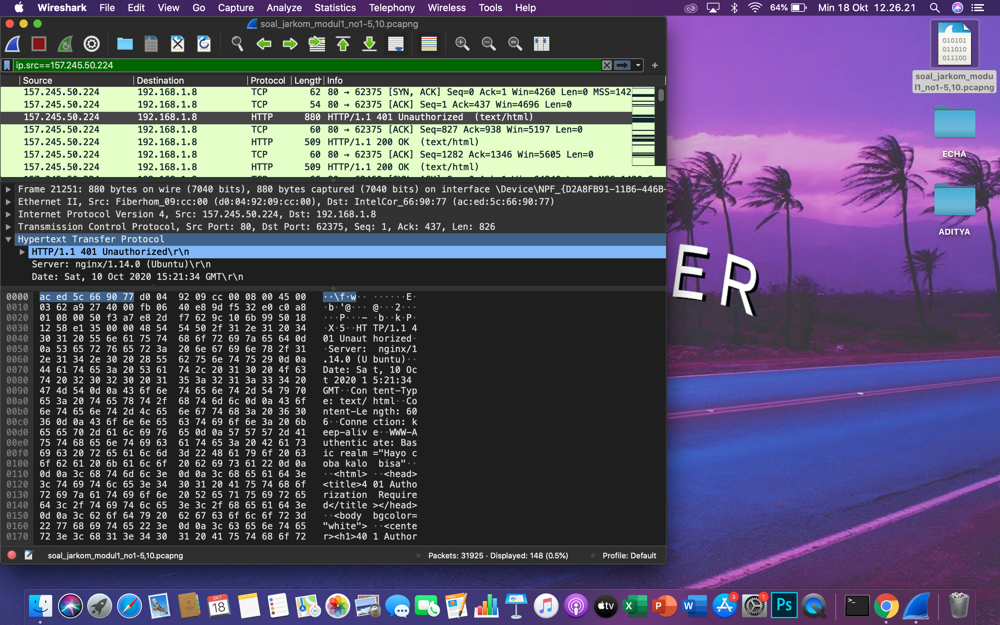
 
 ### soal 2 
 
 menyimpan gambar "Tim_Kunjungan_Kerja_BAKN_DPR_RI_ke_Sukabumi141436.jpg"
 
 jawab :
 buka menu FILE dan pilih submenu export object ke dalam http
 
 lalu seach nama gambar yang ingin dicari dan disimpan
 
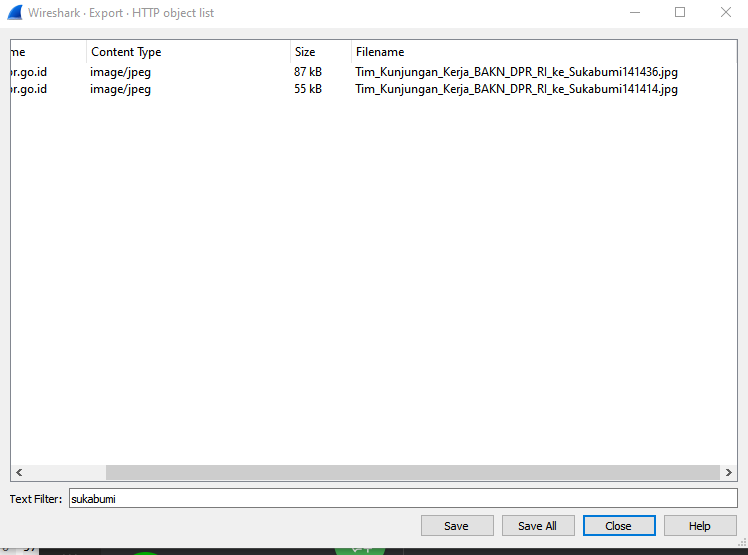

 
 ### soal 3 
 
 Cari username dan password ketika login di "ppid.dpr.go.id"!
 
 jawab :
 username dan password dapat ditemukan dengan pertama menggunakan filter `http.host == ppid.dpr.go.id`
 salah satu packet akan memiliki aplication form yang didalamnya berisikan username dan password
 
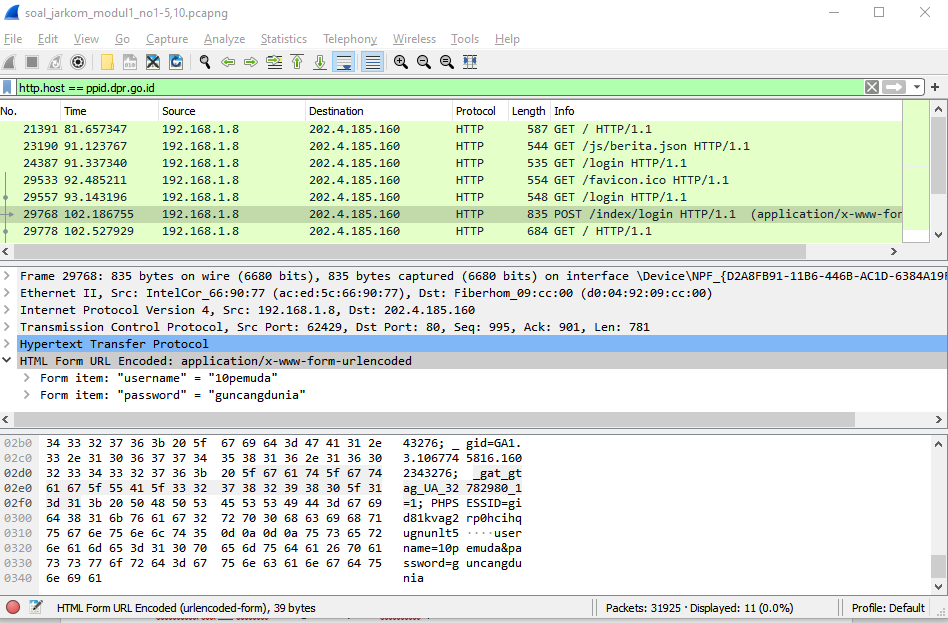
 
 
 ### soal 4 
 
 Temukan paket dari web-web yang menggunakan basic authentication method!

jawab :
dengan menggunakan filter `http.authbasic`

### soal 5

Ikuti perintah di aku.pengen.pw! Username dan password bisa didapatkan dari file .pcapng!

jawab : 
pertama melakukan filter `http.host == aku.pengen.pw`
lalu pada paket yang terfilter pada bagian authorization -> credential akan terlihat password dan usernamenya 

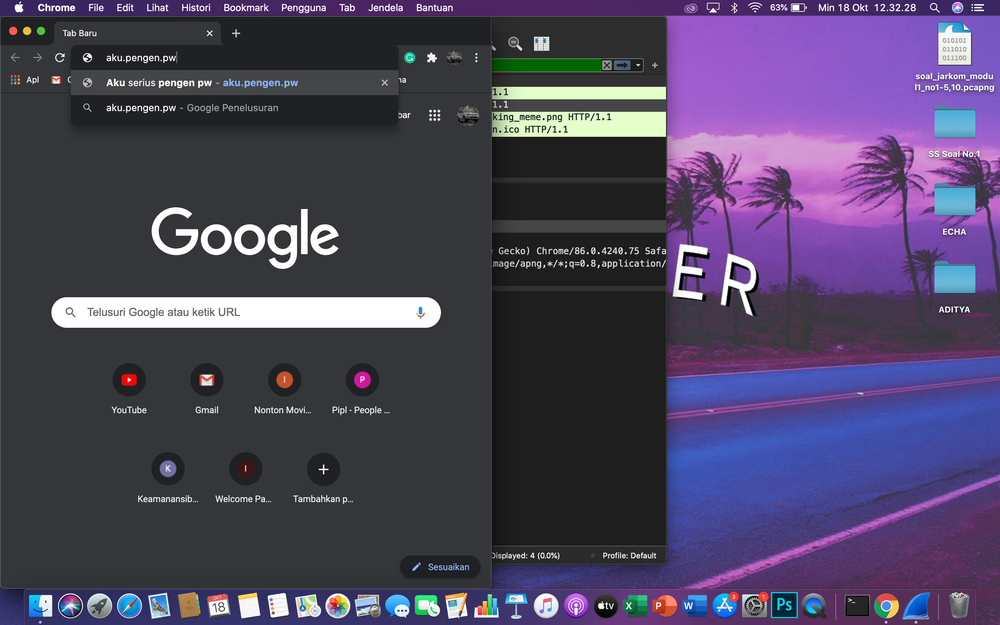

lalu masukkan password dan username pada aku.pengen.pw

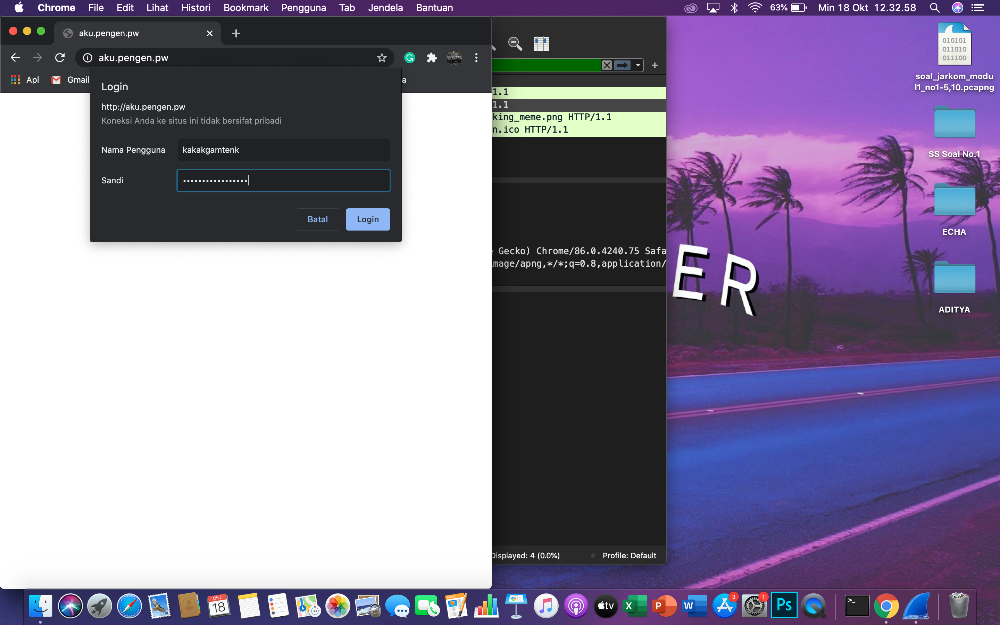

jawab pertanyaan yang ada pada web tersebut 

### soal 6

Seseorang menyimpan file zip melalui FTP dengan nama "Answer.zip". Simpan dan Buka file "Open This.pdf" di Answer.zip. Untuk mendapatkan password zipnya, temukan dalam file zipkey.txt (passwordnya adalah isi dari file txt tersebut).

jawab : 
menggunakan filter `ftp-data` dan menggunakan menu find(ctrl+f) untuk mencari answer.zip dan zipkeynya 
baca paket zipkeynya dengan follow -> tcp stream

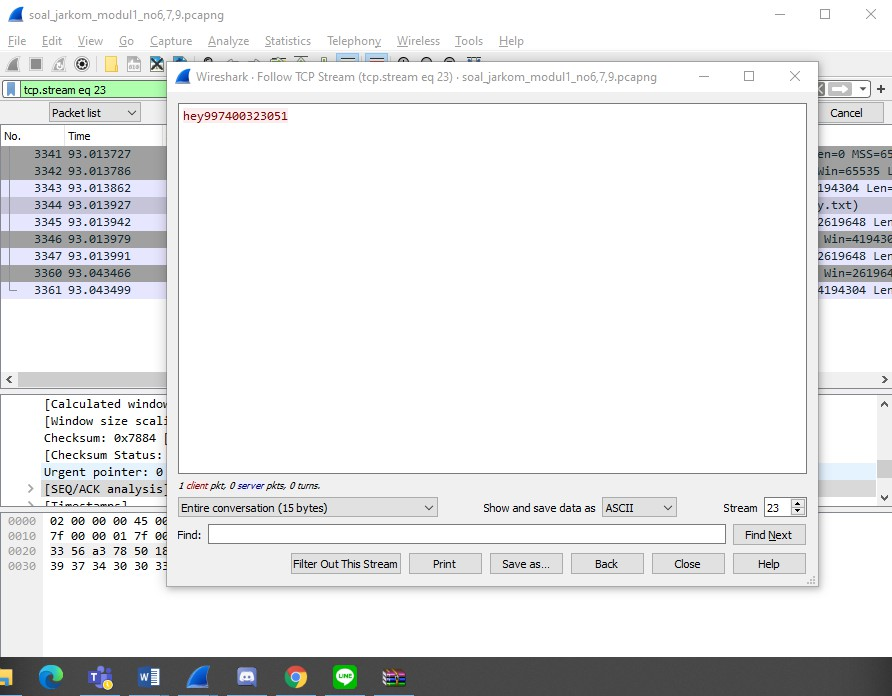

download answer.zip dengan follow-> tcp stream lalu ubah ascii menjadi raw
buka anwer.zip dengan kunci dari zipkey

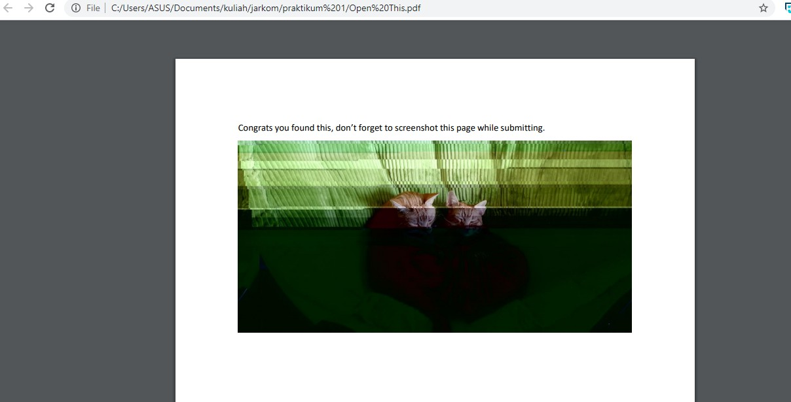

### soal 7

Ada 500 file zip yang disimpan ke FTP Server dengan nama 1.zip, 2.zip, ..., 500.zip. Salah satunya berisi pdf yang berisi puisi. Simpan dan Buka file pdf tersebut.
Your Super Mega Ultra Rare Hint = nama pdf-nya "Yes.pdf"

jawab:
melakukan filter `ftp-data contains Yes.pdf` lalu mensavenya dengan menggunakan follow ->tcp stream dengan mengubah ascii menjadi raw

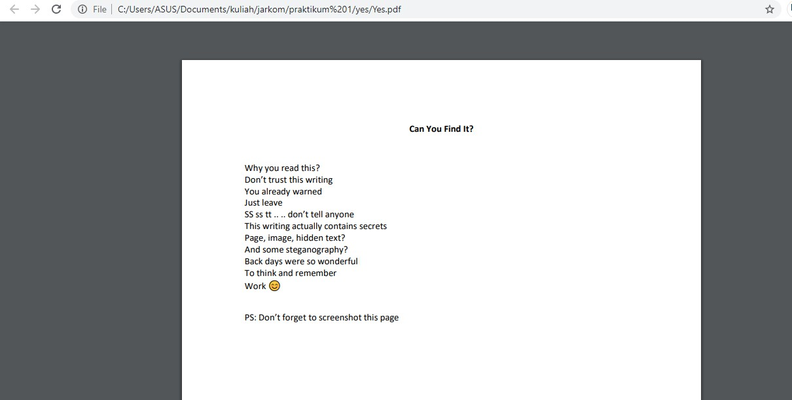

### soal 8

Cari objek apa saja yang didownload (RETR) dari koneksi FTP dengan Microsoft FTP Service!

jawab :
 dengan menggunakan filter `ftp.request && ip.addr == 198.246.117.106`
 
 (photo)
 
 
 ### soal 9
 
 Cari username dan password ketika login FTP pada localhost!
 
 jawab :
 dengan menggunakan filter `ftp` akan terlihat user dan pass 
 
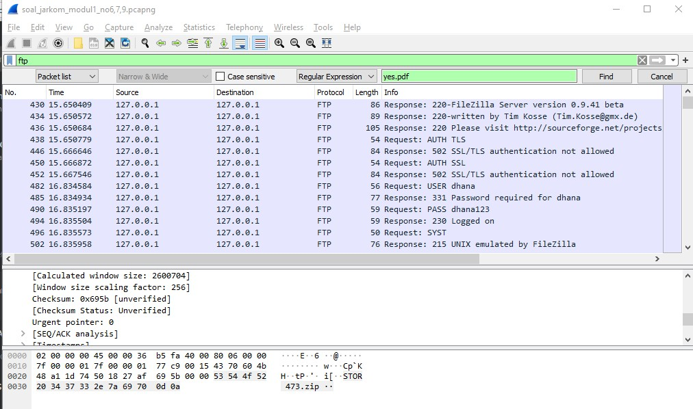

### soal 10

jawab : 
menggunakan fungsi find dan memasukkan clue(25 50 44 46) dengan mengganti tipe find menjadi hex value
dan simpan file menggunakan follow -> tcp stream 

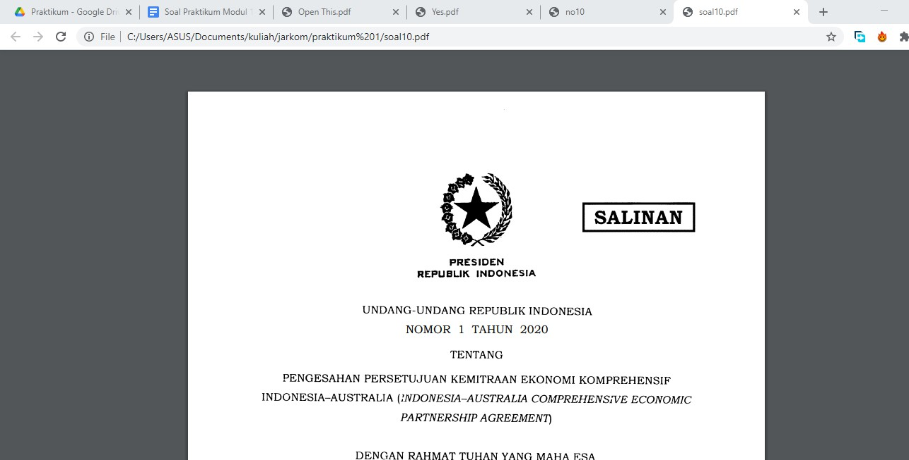

 
## Capture Filter

## soal 11

Filter sehingga wireshark hanya mengambil paket yang mengandung port 21!

jawab :
dengan menggunakan filter `src port 21`

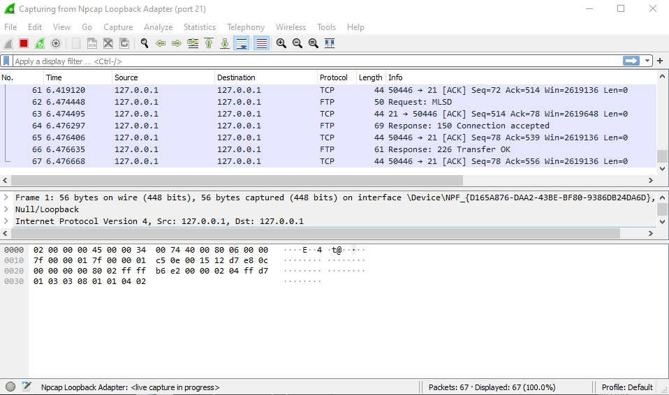

## soal 12

Filter sehingga wireshark hanya mengambil paket yang berasal dari port 80!

jawab : 
dengan menggunakan filter `src port 80`

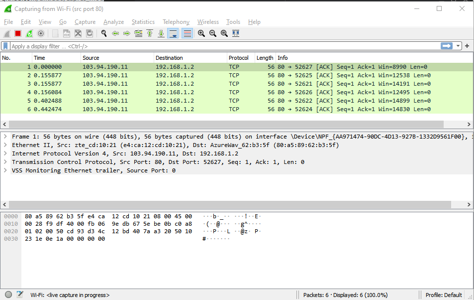

## soal 13

Filter sehingga wireshark hanya menampilkan paket yang menuju port 443!

jawab :
dengan menggunakan filter `dst port 443`

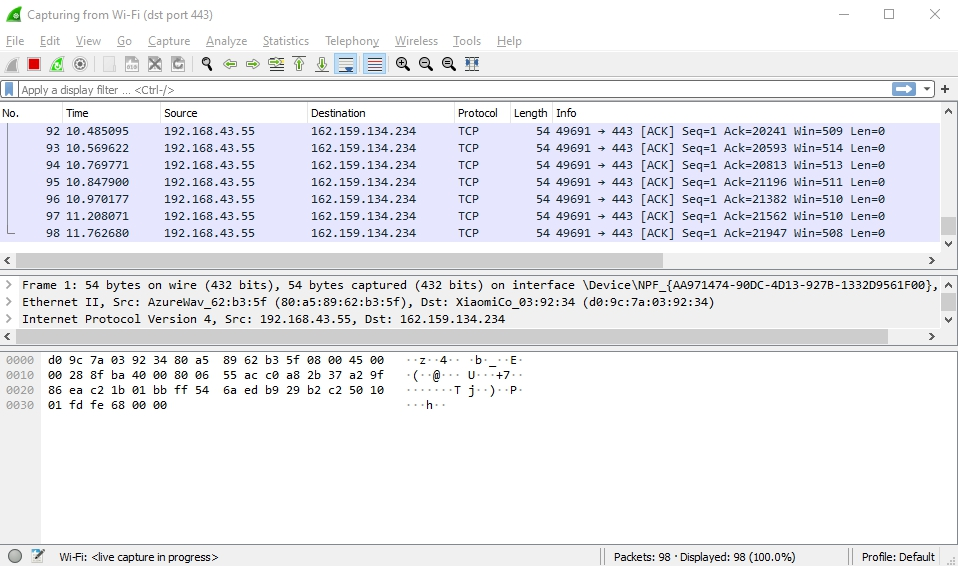

## soal 14

Filter sehingga wireshark hanya mengambil paket yang berasal dari ip kalian!

jawab :
dengan menggunakan filter `src port 192.168.1.2` (ip saya)

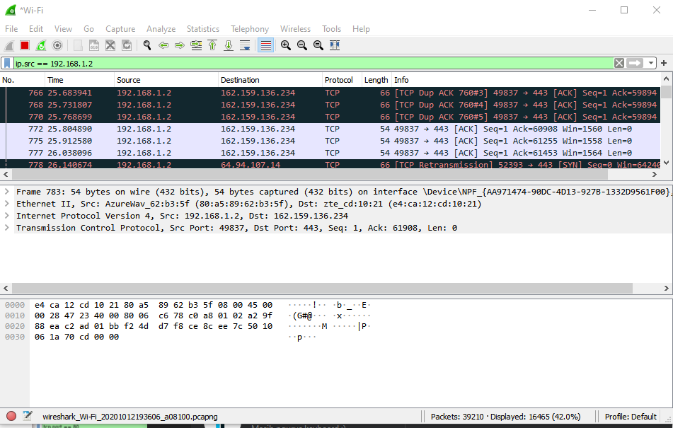

## soal 15

Filter sehingga wireshark hanya mengambil paket yang tujuannya ke monta.if.its.ac.id!

jawab :
dengan menggunakan filter `dst host monta.if.its.ac.id`

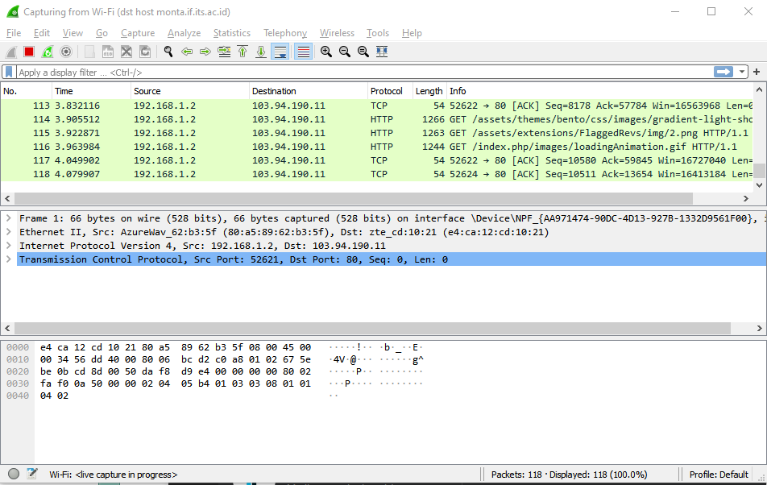

 
